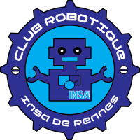

# INSA Rennes Robotics club's documentation

## Documentation

The main documentation is accessible in the [wiki](https://github.com/IR-RC/robot-documentation/wiki).

## Who are we ?

### INSA Rennes

Created in 1966, INSA Rennes is a member of the INSA Group, the leading French network of state graduate and post graduate engineering schools, composed of 6 schools in France, 7 partner schools and 1 international INSA in Morocco. The education at INSA is split in two parts : the first two years are preparatory classes that enable good grounding in the scientific bases and techniques. In the last three years are taught one of the seven engineering specialities :

* __Information, Communication Systems & Technologies__
   * Electronics and Computer Engineering
   * Communication Systems and Networks
   * Computer Science
   * Mathematical engineering

* __Materials, Structures & Mechanical Engineering__
   * Materials Science and Engineering
   * Civil Engineering and Urban Planning
   * Mechanical and Control Systems Engineering

[Link to INSA Rennes's website](http://www.insa-rennes.fr/en.html)

### INSA Rennes Robotics club

The robotics club is a member of the INSA's union student association : AEIR. Since 1998, the club has been competing at the French Robotic cup. In 2013 and 2014, the club stopped his activity as no student was available to succeed. In 2015, activities restarted with a new team of ten students with these objectives :

* Design and build a new and simpler modular robot to improve team efficiency
* Provide a complete documentation about the club organisation and the robot design for the next teams
* Use of internal communication tools such as Slack and Trello

(No website available for the moment)

### The French Robotics cup - Eurobot

The robotics cup is scientific, technical and fun challenge in which fully autonomous robots built by team of robotics enthusiasts are facing each other. The robots fight in 90-second matches. The rules change every year. For more information, please visit the website of Eurobot (link below).

[Link to Eurobot's website](http://www.eurobot.org/)
